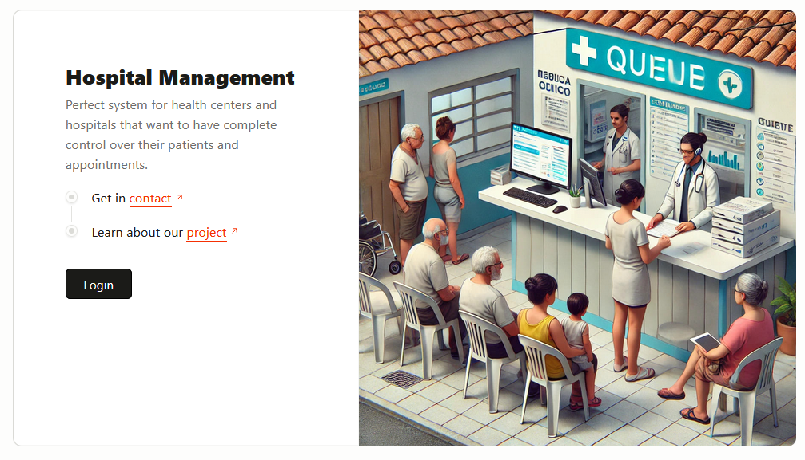
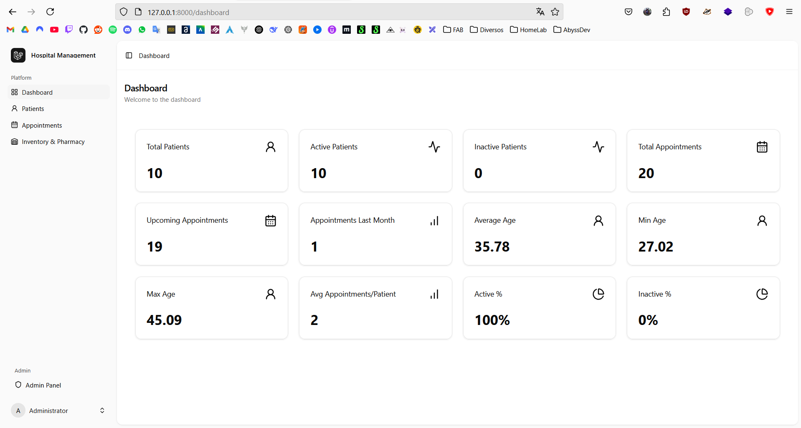

# Sistema de Gestão Hospitalar Open Source

Um sistema de gestão hospitalar open-source criado para otimizar as operações hospitalares. Este sistema oferece ferramentas para gerenciamento de pacientes, agendamentos, prontuários médicos, equipe, finanças, estoque e muito mais.



## 🚀 Funcionalidades

Este sistema oferece ferramentas completas para gestão de pacientes, incluindo prontuários eletrônicos, agendamento de consultas e acompanhamento de tratamentos. Também possui suporte para gestão da equipe com escala de plantões, ferramentas de comunicação e cadastro de especialidades.

As operações financeiras são otimizadas com faturamento, gerenciamento de convênios e relatórios financeiros. O controle de estoque e farmácia garante rastreamento adequado de medicamentos e materiais.

Funcionalidades adicionais incluem gerenciamento de exames e laboratório, acompanhamento de atendimentos de emergência e ferramentas de BI para geração de relatórios e dashboards. O sistema prioriza segurança e conformidade, oferecendo controle de acesso, auditoria de registros e aderência à LGPD e HIPAA.

## 🔧 Instalação e Deploy

Você pode rodar este projeto de duas formas:

### ✅ Método 1 - Ambiente local (requer PHP, Node, etc.)

**Pré-requisitos:**

- PHP >= 8.3
- Composer
- Node.js >= 20.x
- MySQL ou SQLite
- Extensões do PHP: `mbstring`, `xml`, `bcmath`, `curl`, `zip`, `pdo`, `sqlite3`, `mysql`, `gd`, `tokenizer`

**Passos:**

1. Clone o repositório

    ```bash
    git clone https://github.com/CaioSimioni/pi3-app.git
    ```

    ```bash
    cd pi3-laravel
    ```

2. Instale as dependências PHP

    ```bash
    composer install
    ```

3. Instale as dependências JS

    ```bash
    yarn install
    ```

4. Compile os assets

    ```bash
    yarn build
    ```

5. Configure o ambiente

    ```bash
    cp .env.example .env
    ```

    ```bash
    php artisan key:generate
    ```

6. Configure o banco de dados no `.env`

    Atualize as variáveis: `DATABASE_URL`, `DB_CONNECTION`, `DB_DATABASE`, etc.

7. Rode as migrations e seeds

    ```bash
    php artisan migrate --seed
    ```

8. Inicie o servidor

    ```bash
    php artisan serve
    ```

Acesse em: [http://localhost:8000](http://localhost:8000)

### 🐳 Método 2 - Docker (isolado, pronto para dev)

**Pré-requisitos:**

- Docker instalado

**Passos:**

1. Clone o repositório

    ```bash
    git clone https://github.com/CaioSimioni/pi3-app.git
    cd pi3-app
    ```

2. Construa a imagem

    ```bash
    docker build -t pi3-app .
    ```

3. Rode o container

    ```bash
    docker run -p 8080:8080 --rm pi3-app
    ```

Acesse em: [http://localhost:8080](http://localhost:8080)

> O Dockerfile faz tudo: instala dependências, cria `.env`, compila os assets, roda as migrations e inicia o app.

## 📲 Uso

- Acesse `http://localhost:8000` (modo local) ou `http://localhost:8080` (Docker).
- Faça login com a conta admin padrão (se existir) ou crie uma nova.



## 📝 Licença

Este projeto está licenciado sob a [Licença MIT](LICENSE).

## 🤝 Contribuindo

Contribuições são bem-vindas! Veja o arquivo [CONTRIBUTING.md](CONTRIBUTING.md) para mais detalhes sobre como contribuir. Lá tem instruções sobre setup do ambiente de dev, padrões de código e envio de PRs.

Sinta-se livre pra dar fork no repositório, criar uma branch nova e mandar sua contribuição. A gente valoriza demais quem ajuda a melhorar esse projeto!

Pra mudanças grandes, abra uma issue antes pra discutir a ideia.

## 📬 Contato

Dúvidas, bugs ou sugestões? Abre uma issue no GitHub que a gente responde!

## 🌟 Contribuidores

Agradecimentos aos seguintes contribuidores pelo esforço em melhorar o projeto:

[](https://github.com/CaioSimioni)
[](https://github.com/JustinoSilva15)
[](https://github.com/lucashdc)
[](https://github.com/PEDROIAGOP5)
[](https://github.com/benjamin-sanches)

Contribuições são sempre bem-vindas! Dá uma olhada na seção [Contribuindo](#-contribuindo) pra começar.
